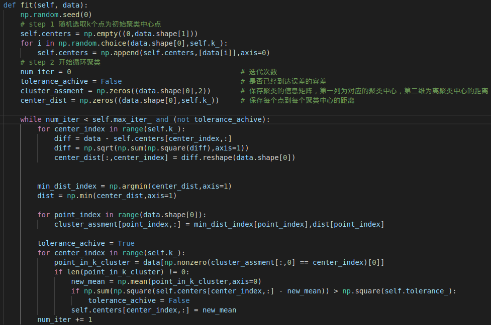
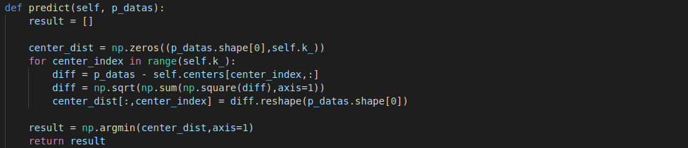
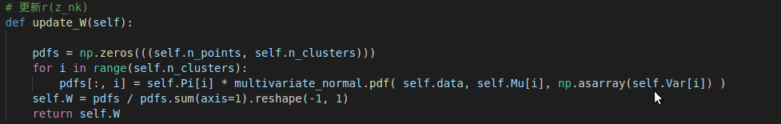
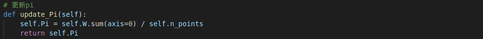
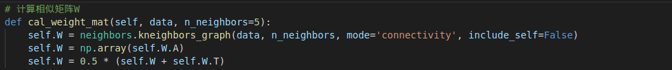
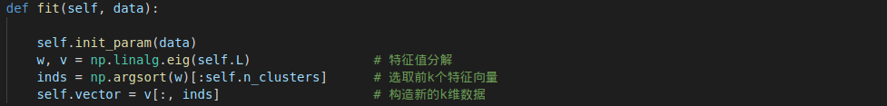
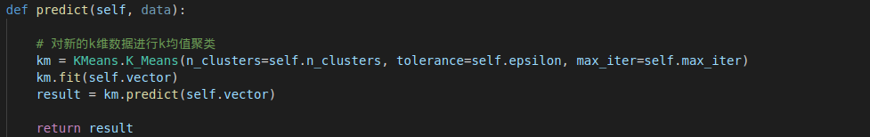

# 第三章作业

本次作业主要实现了 k 均值聚类，高斯混合分布聚类以及谱聚类的代 码，并在给定的数据点集上进行对比

## K-means核心代码

### fit

### predict:

## GMM 核心代码

### 更新$r(z_{nk})$

### 更新$\mu$

### 更新$\sum$

### 更新$\pi_k$

## Spectral_Clustering 核心代码

### 构造相似性矩阵 W :

### 分解拉普拉斯矩阵 L 并获取新的 k 维映射数据点:

### 对新的 k 维映射数据点进行 k-mean 聚类:

## 结果对比

使用作业中给定的对比代码，对自己完成的三种算法进行对比，结果如下:

