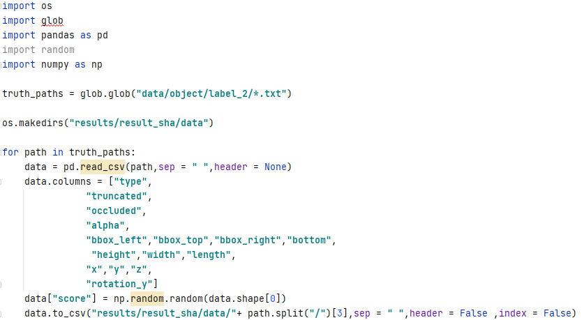

# 第六章作业

本次作业主要是熟悉 KITTI 数据集官方提供的评估工具，本次作业分为三个部分:

## KITTI 数据集评估工具简介

KITTI 评估工具主要包括三种任务的评估，分别是 2D 物体检测和旋 转估计，3D 物体检测以及鸟瞰视角的评估。对于每种任务，数据集提供了 7481 张训练图片(点云)和 7518 张测试图片(点云)。尽管数据集官方对 于每张图片(点云)标注了 8 个类别，但是在评价过程中只使用了行人，自 行车和汽车三类，官方给出的原因是只有这三类有足够的实例用于训练和 评估模型。在使用数据集时，官方提醒我们注意以下两点:

- 结果的文件名一定要对应于真实数据的文件名
- 结果的保存格式一定要符合官方要求，需要同时提供 2D 和 3D 边界 框，同时，对于在图像平面上无法观察到的边界框，要过滤掉，不能添 加到结果中。

接下来对于 label 的格式进行介绍，主要将 label 分为以下几部分:

* 1  type 检测到的具体类别，共有九类(包含无效类)

* 2  truncated从0-1的浮点数，标志着检测到的边界框离开图像平面的比 例

* 3  occluded 表示边界框是否被其他物体遮挡

* 4  alpha 从传感器中心到边界框中心的连线在水平面上的投影角度

* 5-8 bbox 2D 边界框，以左，上，右，下的顺序使用像素坐标描述 9-11 dimensions 3D 边界框，以高，宽，长的顺序以米为单位进行度量

* 12-14 location 3D 边界框的位置，以 x，y，z 的顺序以米为单位进行度量

* 15  rotation_y 在相机坐标系下沿着 y 轴的旋转角度

* 16  score 置信度，为 0-1 之间的浮点数(此项只在预测结果中出现，也是 进行评估的关键)

其次，我们需要注意结果和真实标签的保存目录:(这里我们认为当前目录 为编译后生成的可执行文件所在目录)

* 真实值保存在./data/object/labes_2 下

* 结果保存在./results/result_sha(这个文件下由自己确定)/data 下 
* 评估结果保存在./results/result_sha/plot 下

最后，在进行编译评估脚本之前，我们需要安装以下库文件

* libboost-all-dev 
* gnuplot
* texlive-extra-utils

## 仿真数据评估

对真实标签添加 socre 列，生成仿真数据，生成脚本如下:

具体的评估结果见附件文件夹

## POINTRCNN 网络评估

根据 githubPOINTRCNN 作者的代码:https://github.com/sshaoshuai/PointRCNN 对训练网络的生成结果，由于作者专注于车辆检测，故结果只对 car 分类进 行评估，具体评估结果见附件文件夹，在使用 POINTRCNN 时候需要注意以下几点环境要求:

- python >= 3.6

- 1.0 <= pytorch <=1.4.0(此版本为最高可以编译作者代码的版本，再

  高由于更改了 API，需要修改源码)

- cuda < 11(11 以上的版本由于 API 的变更，无法成功编译自定义

  cuda 层，本人使用 10.1 进行测试可以正常编译)

- gnu <= 8(对于 ubuntu20.04 需要降级)

此外，在使用作者提供的网络结果到 KITTI 结果格式的转化脚本时需要注 意将 ImageSets 里面的 val 文件替换为包含全部训练文件名称的脚本，作者 默认为使用一半的数据进行评估，与真实标签大小不对应，无法正确评估。

