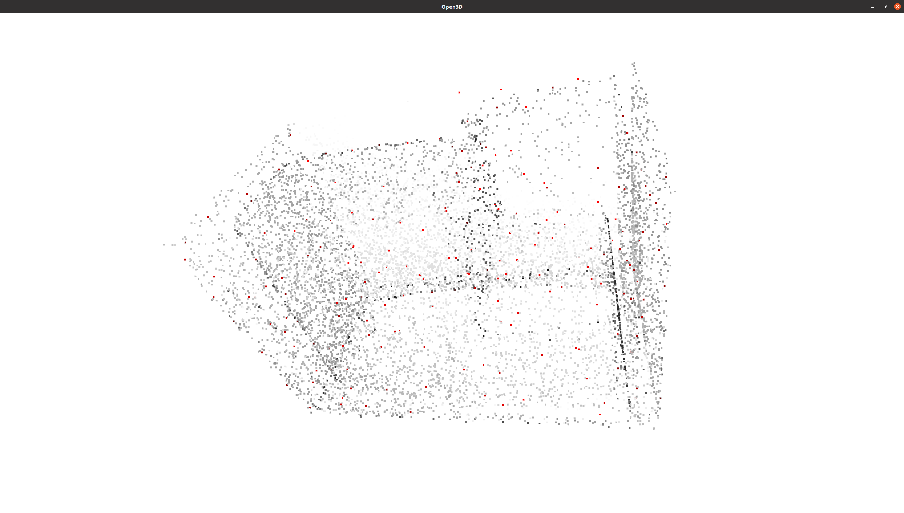
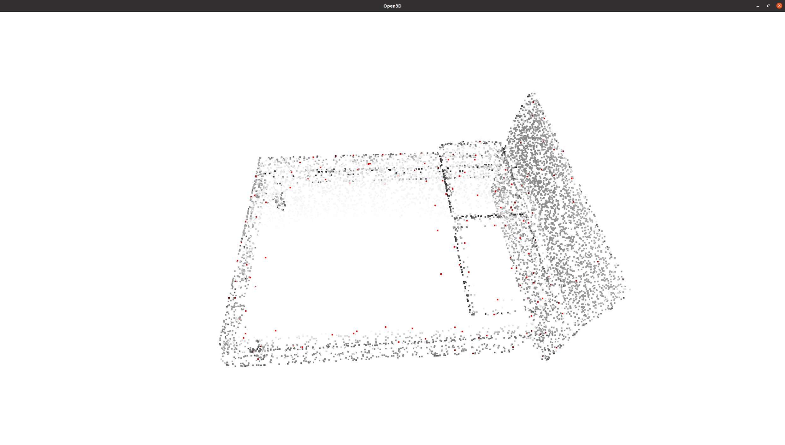
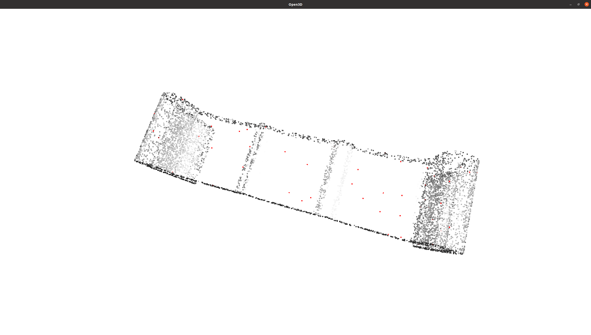

# 第七章作业

本次作业主要是实现 ISS 的 3D 特征点检测

## 算法流程

ISS 的算法流程主要分为以下几个部分

* 针对点云中的每个点完成以下步骤
  * 在半径 r 内寻找邻居点
  * 对于每个邻居，记录其半径 r 内的邻居数量，构造权重向量 – 计算加权协方差矩阵
  * 特征值分解，记录降序排列的三个特征值 λ1, λ2, λ3

* 进行非极大值抑制，在每个 r 内只保留一个 λ3 最大的点
* 对进行非极大值抑制后的点进行筛选，排除不符合特征值相对比例及最小特征值要求的点

## 参数说明

在 ISS 的使用中，存在大量的超参数需要调节，这也是 ISS 算法通用性和表现效果不佳的主要原因之一，主要包括以下各项

* radius 构造协方差和进行非极大值抑制时候的搜索邻域，针对不同的 点云需要专门调整，极为难调

- kmin 最小邻居数量，这个参数在课程中没有出现，但个人认为也是一 个超参，如果邻居数量太少，那么协方差矩阵会严重收到噪声点的影响
- γ21 , γ32 这两个参数也需要针对不同的点云专门调整
- minλ3 这个参数是一个极为重要的参数，严重受到点云分布的影响，实验中采用了 2 倍所有 λ3 均值的方法，但效果不是很好

## 加速技巧

在作业代码中使用了两个方法来加速计算，避免不必要的重复计算

* 在计算协方差时候计算一个哈希映射，将每个点映射到对应的邻居点 数量，避免在计算权重矩阵时候多次访问同一个点
* 使用 python 数据结构 heapq 来进行非极大值抑制

## 结果展示

由于时间有限，没有时间精细调整上述的参数，只给了一个大概值，效果不是非常好，但也侧面证明了一个准确高效的三维特征点提取目前确实是一个比较难以处理的问题

1. 

