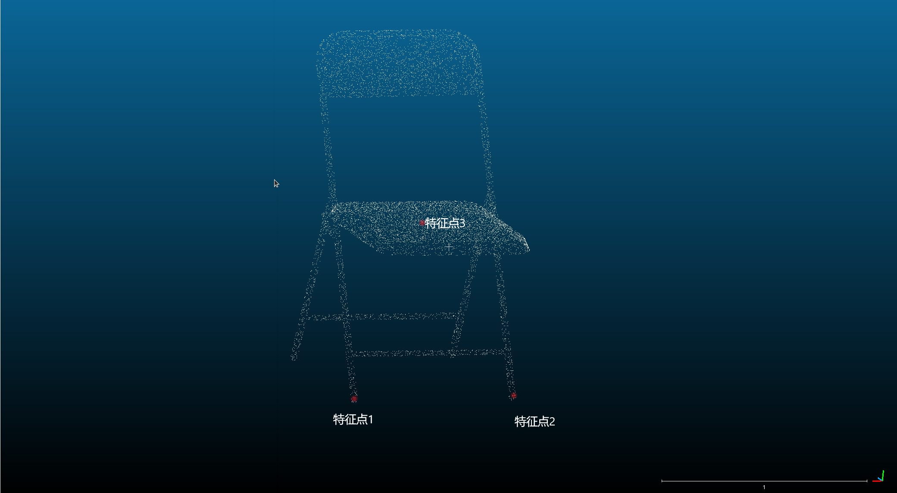
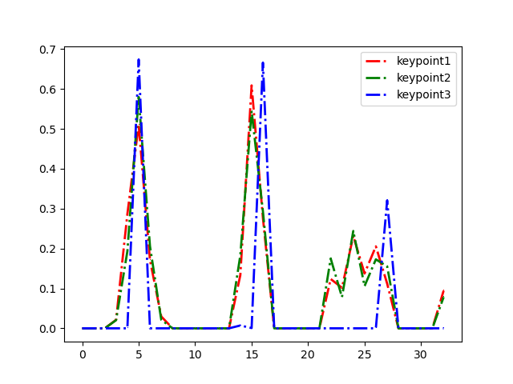

# 第八章作业

本次作业主要是完成了 FPFH 的特征描述方法

## 算法流程

FPFH 的算法流程主要分为以下几个部分 

* 对关键点根据半径 r 进行最近邻搜索

* 对每个邻居节点计算 SPFH 描述子

* 根据距离计算权重矩阵

* 计算特征点本身的 SPFH 描述子 
* 计算加权后的最终 FPFH 描述子

## 参数说明

在使用过程中主要需要调节 2 个参数，一为半径 r，这个参数需要针对 具体的点云进行具体的调整。二是每一个维度的直方图分段数 B，此处选择 11 为默认值

## 结果展示

如下图所示在点云中选取三个点作为关键点，其中 1 和 2 为相似特征 点，3 为外点

使用自己实现的 FPFH 算法对这三个特征点提取了描述子，并进行了可视化

根据结果可以看出，具有相同几何结构的特征点的描述子十分相似，几何结构不同的特征点的描述子有明显区别。