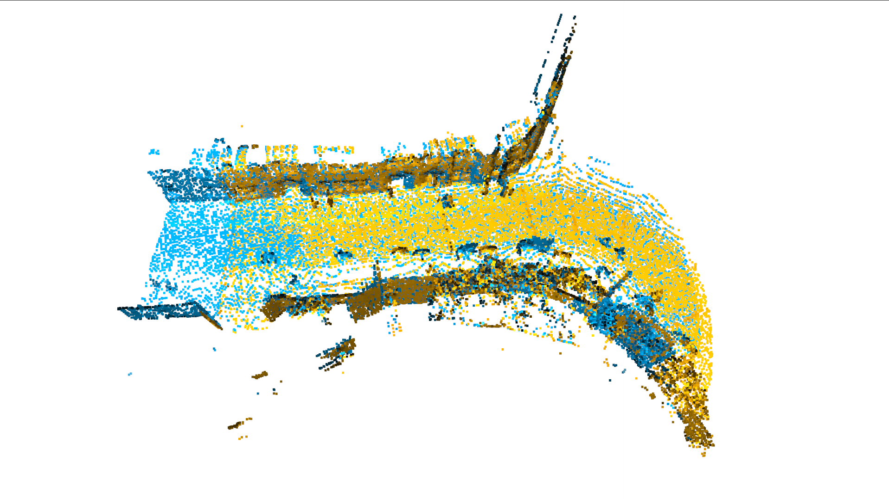

# 第九章作业

本次作业的主要目的是完成RANSAC粗匹配获得初始解，之后使用ICP方法对初始解进行优化以获得两帧之间的最终匹配。由于使用自己编写的特征点提取，描述子提取以及RANSAC代码在python环境中执行效率过低，所以本次选择使用open3d的API进行实现。

## RANSAC+ICP配准流程总结

* 点云预处理：本次选择的预处理方法为voxel滤波方法，根据多次实验，选取的voxel_size = 1

  滤波之前的点云:

  

  滤波之后的点云:

* 在降采样之后的点云上提取特征点和描述子

* 进行RANSAC粗匹配

  * 根据描述子选取部分特征点
  * 使用优化的方法获取位姿
  * 检查获取的位姿是否有效，这里使用三个准则：
    * CorrespondenceCheckerBasedOnEdgeLength：在原始点云中选取两个点构成直线，与目标点云中对应点构成的直线计算直线长度的相似性
    * CorrespondenceCheckerBasedOnDistance：检查原始和目标点云中选取出来的特征点云经过变换后是否足够接近
    * CorrespondenceCheckerBasedOnNormal：检查原始和目标特征点云的对应点的法向量是否相似
  * 如果位姿是有效的，那么对于原始点云应用变换，与目标点云进行收敛性检查，这里主要使用两个准则判断收敛性
    * max_iteration=100000
    * confidence=9.990000e-01

  具体的设置方法可以参考[here](http://www.open3d.org/docs/release/python_api/open3d.pipelines.registration.registration_ransac_based_on_feature_matching.html)

  RANSAC匹配后的结果如下:

  

* 在RANSAC匹配获取的初始位姿基础上对原始未进行降采样的点云使用点面ICP进行再次配准

  ICP配准后的结果如下:

  

  ICP的相关设置可以参考[here](http://www.open3d.org/docs/release/python_api/open3d.pipelines.registration.registration_icp.html)

至此，整个点云配准流程就已经结束，详细的代码参考[here](./Registration_o3d.py)

最后的评估结果保存在**./registration_dataset/reg_result_teamo.txt**

同时，也提供了自己参考github和open3d源代码实现的RANSAC配准流程，详细的代码参考[here](./Registration.py)，相应的评估结果保存在**./registration_dataset/reg_result_teamo1998_test.txt**

