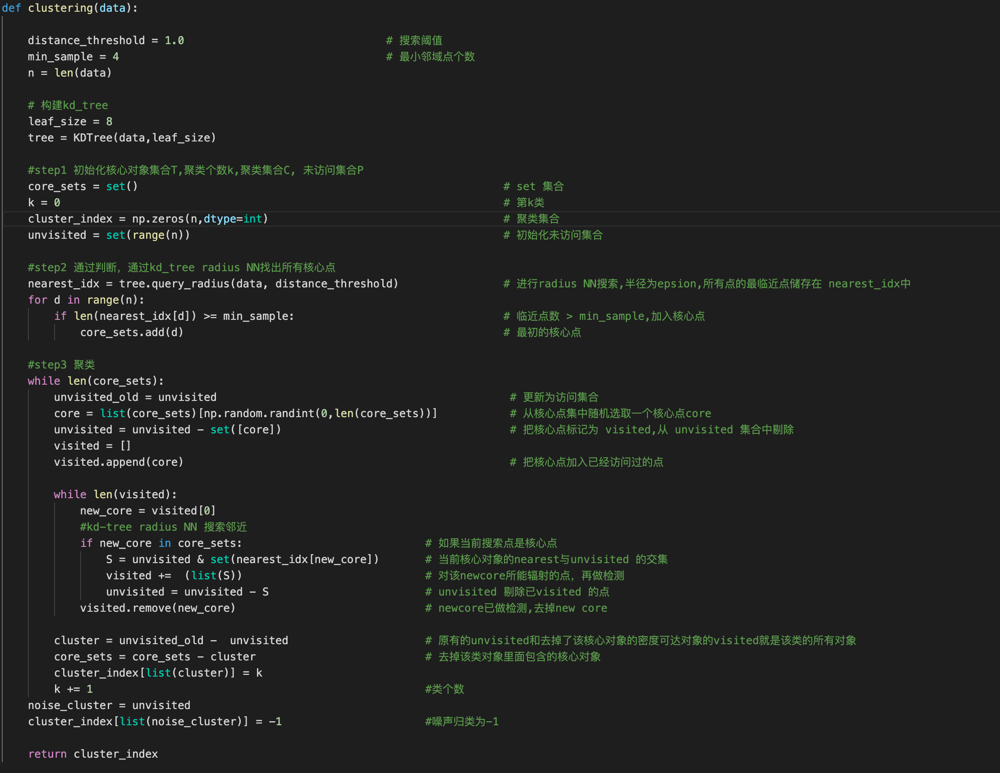
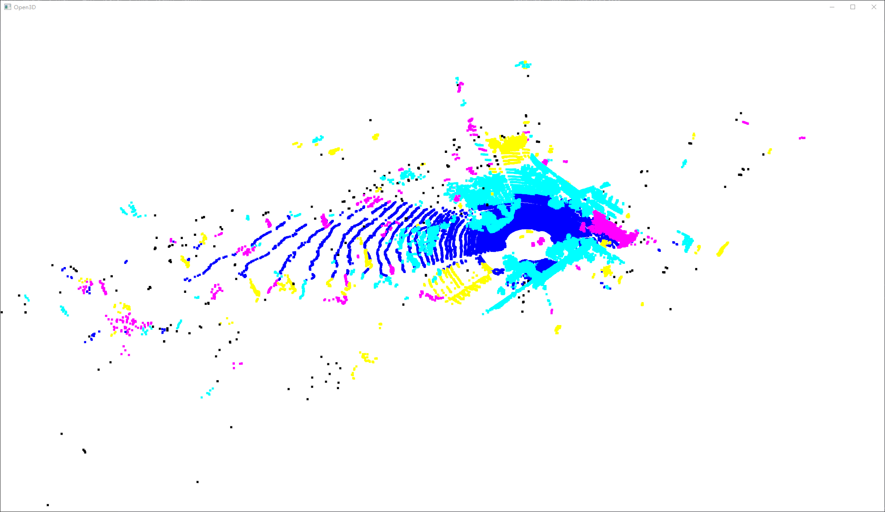
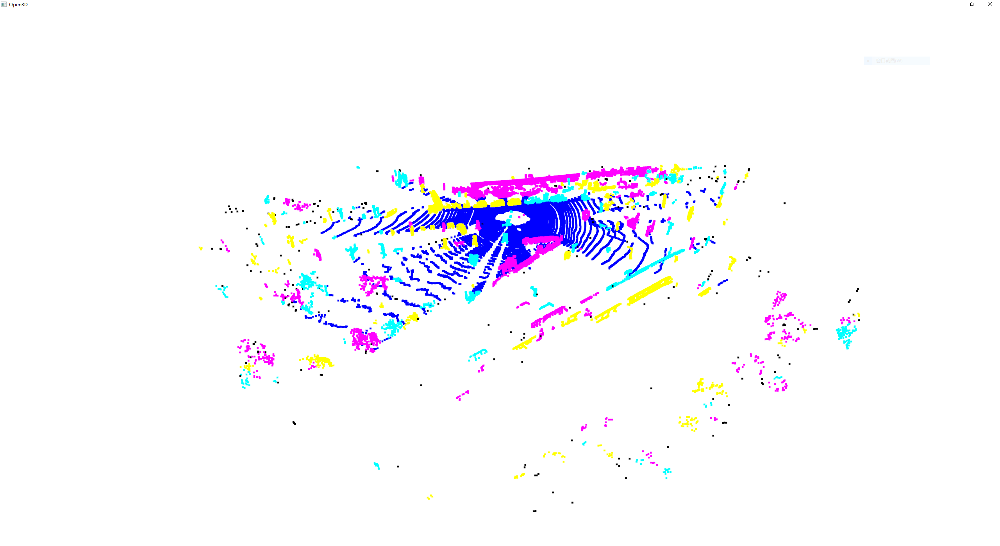
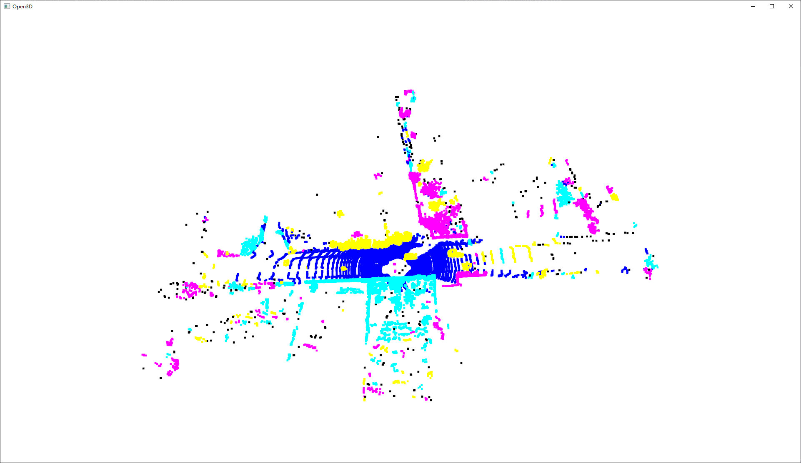

# 第四章作业

本次作业主要是为了完成对于给定的点云进行地面去除以及对去除后 的点云进行聚类的过程，选择了使用 RANSCA 进行地面拟合及 DBSCAN 进行聚类

## RANSCA 地面拟合

## DBSCAN 聚类

## 结果展示

在 velodyne 数据集中选取了三个数据进行实验，并使用 open3d 进行 显示，结果如下

上述实验结果看起来颜色颜色比较少，但只是颜色映射的问题，每张图 片的类别数都不小于 100，聚类算法是没有问题的，只是没有对每个类别分配一个可以区分的颜色。本次作业还有可以提高效率和效果的方面:

- 本次实验在法向量计算中的特征值分解方面花费了大量的时间，可以 采用其他的快速获取法向量的方法，但是在法向量计算上的花费大大 减少了 RANSAC 迭代的次数，根据代码中选择的提前结束 RANSAC 准则和初始点的选取规则，RANSAC 平均迭代次数不会超过三次
- 在获取到平面后可以使用内点及非线性最小二乘方法对平面进行优化， 同时进一步添加忽略的内点和错误认为是内点的外点
- 进行 DBSCAN 时候大部分时间花在了邻近搜索，可以采用 octree 代 替 kdtree 进一步提高效率

